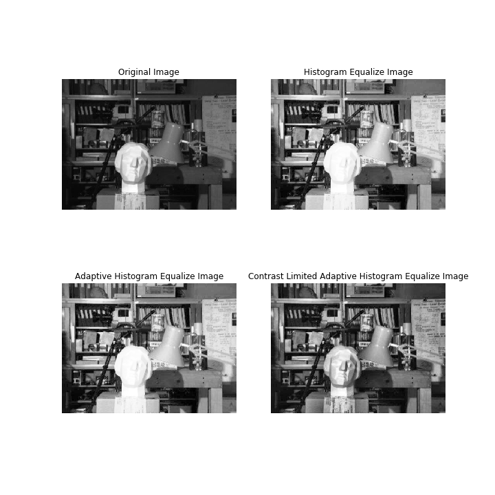
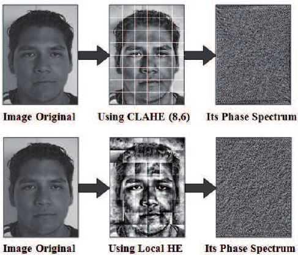

# Dataset

Pada pengerjaan *Final Project* kali ini, dataset yang kami gunakan adalah *The Extended Cohn-Kanade* (CK+). CK+ merupakan versi perluasan dari dataset *Cohn-Kanade* (CK). Pada tahun 2000, dataset CK dirilis dengan tujuan mempromosikan penelitian untuk secara otomatis mendeteksi ekspresi wajah individu. Sejak itu, dataset CK telah menjadi salah satu *test-bed* yang paling banyak digunakan untuk pengembangan dan evaluasi algoritma.

Setiap ekspresi yang terdapat pada dataset CK+ diberi label berdasarkan aturan-aturan spesifikasi *The Facial Action Coding System* (FACS). FACS sendiri terdiri dari *Action Units* (AU) dan deskripsi dari beberapa pergerakan otot wajah. Berikut merupakan hasil dari penentuan label menurut FACS:

.PNG)

*Tabel 1. Frekuensi jumlah AU yang terdeteksi pada dataset*


*Tabel 2. Deskripsi ekspresi berdasarkan FACS*

## Distribusi dan Struktur Dataset

Pada dataset CK+, folder ekspresi dan folder label dipisahkan, namun semua nama dan struktur file harus sama. Misalnya, sebuah gambar di `cohn-kanade-images/S005/001/S005_001_00000011.png` akan memiliki data label emosi pada `Emotion/S005/001/S005_001_00000011_emotion.txt`.

Berikut contoh struktur dalam dataset:
```
.
├── 0 - prepare dataset.ipynb
├── cohn-kanade-images
│   ├── S005
│   │   └── 001
│   │       ├── S005_001_00000001.png
│   │       ├── S005_001_00000002.png
│   │       ├── S005_001_00000003.png
│   │       ....
│   ├── S010
│   │   ├── 001
│   │   │   ├── S010_001_00000001.png
│   │   │   ├── S010_001_00000002.png
│   │   │   ├── S010_001_00000003.png
│   │   │   ....
│   │   ├── 002
│   │   │   ├── S010_002_00000001.png
│   │   │   ├── S010_002_00000002.png
│   │   │   ├── S010_002_00000003.png
│   │   │   ...
│   │   ...
│   ...
├── Consent-for-publication.doc
├── CVPR2010_CK.pdf
├── Emotion
│   ├── S005
│   │   └── 001
│   │       └── S005_001_00000011_emotion.txt
│   ├── S010
│   │   ├── 001
│   │   ├── 002
│   │   │   └── S010_002_00000014_emotion.txt
│   │   ├── 003
│   │   ├── 004
│   │   │   └── S010_004_00000019_emotion.txt
│   │   ├── 005
│   │   └── 006
│   │       └── S010_006_00000015_emotion.txt
│   ...
├── Emotion_labels.zip
├── extended-cohn-kanade-images.zip
├── FACS_labels.zip
├── haha.txt
├── Landmarks.zip
└── ReadMeCohnKanadeDatabase_website.txt

1423 directories, 11044 files
```

Pada `S005/001/S005_001_00000011.png`, `S005` mengindikasikan `S`ample potret individu ke-`005`, `001` mengindikasikan ekspresi ke-`001` yang diemosikan, dan sekuens terakhir (contoh: `00000011`) merupakan urutan *frame* dari setiap ekspresi. Oleh karena itu, walaupun terdapat banyak *frame* pada penangkapan setiap ekspresi, hanya *frame* terakhir yang memiliki struktur yang sama dengan label emosi. *Frame* terakhir dianggap sebagai puncak dari ekspresi yang paling sesuai menggambarkan emosi.

Data label emosi yang terdapat pada `Emotion/.../.../...txt` berisi teks yang bernilai 0-7 ('0.00000000e + 00', '1.00000000e + 00', '2.00000000e + 00', ..., '7.00000000e + 00'). Nilai-nilai tersebut merupakan konversi dari ekspresi sesungguhnya sebagai berikut:
- 0 = Netral (*Neutral*)
- 1 = Marah (*Anger*)
- 2 = Acuh (*Contempt*)
- 3 = Jijik (*Disgust*)
- 4 = Takut (*Fear*)
- 5 = Bahagia (*Happy*)
- 6 = Sedih (*Sadness*)
- 7 = Terkejut (*Surprise*)

## Pre-processing

Pertama-tama, mari kita ``import`` beberapa *libraries* yang akan kita butuhkan.

[[INI BAGIAN IMPORT2]]

Setelah itu, untuk pemrosesan citra terlebih dahulu kita menggunakan metode *Contrast Limited Adaptive Histogram Equalization* (CLAHE) dan algoritma *Haar Cascade* sebagai *classifier* mula-mula. Metode CLAHE dan *Haar* telah tersedia pada package ``cv2``.

[[INI YANG BAGIAN ABIS IMPORT2]]

CLAHE merupakan metode perluasan dari *Adaptive Histogram Equalization* (AHE) yang merupakan pengembangan dari *Histogram Equalization* itu sendiri. AHE biasa cenderung meng-*over* amplifikasi kontras di daerah distribusinya, karena histogram di daerah tersebut sangat terkonsentrasi. Sebagai hasilnya, AHE dapat menyebabkan *noise* diperkuat di daerah yang hampir konstan. CLAHE adalah varian AHE di mana amplifikasi kontras terbatas, sehingga dapat mengurangi masalah amplifikasi *noise* ini. Berikut perbedaan antara HE, AHE, dan CLAHE:



*Gambar 1. HE vs AHE vs CLAHE*



*Gambar 2. HE vs AHE vs CLAHE*

Dalam CLAHE, amplifikasi kontras di sekitar nilai piksel yang diberikan didapatkan dari gradien fungsi transformasi (sebanding dengan CDF) dan karenanya untuk nilai histogram pada nilai piksel tersebut. CLAHE membatasi amplifikasi dengan memotong histogram pada nilai yang telah ditentukan sebelum menghitung CDF. 

[[bagian in [3], haar belum dijelasin]]

Untuk menelusuri struktur direktori pada dataset, kita dapat menggunakan fungsi `os.walk()`. Fungsi ``load_emotion_labels()`` digunakan untuk memproses dan menyimpan label-label.

[[INI BAGIAN load_emotion_label()]]

Selanjutnya, kita memproses data image dan 