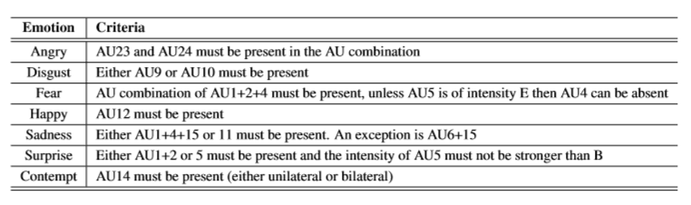

# Dataset CK+

## Penjelasan Dataset

Pada pengerjaan *Final Project* kali ini, dataset yang kami gunakan adalah *The Extended Cohn-Kanade* (CK+). CK+ merupakan versi perluasan dari dataset *Cohn-Kanade* (CK). Pada tahun 2000, dataset CK dirilis dengan tujuan mempromosikan penelitian untuk secara otomatis mendeteksi ekspresi wajah individu. Sejak itu, dataset CK telah menjadi salah satu *test-bed* yang paling banyak digunakan untuk pengembangan dan evaluasi algoritma.

Setiap ekspresi yang terdapat pada dataset CK+ diberi label berdasarkan aturan-aturan spesifikasi *The Facial Action Coding System* (FACS). FACS sendiri terdiri dari *Action Units* (AU) dan deskripsi dari beberapa pergerakan otot wajah. Berikut merupakan hasil dari penentuan label menurut FACS:

.PNG)

*Tabel 1. Frekuensi jumlah AU yang terdeteksi pada dataset*



*Tabel 2. Deskripsi ekspresi berdasarkan FACS*

## Distribusi dan Struktur Dataset

Pada dataset CK+, folder ekspresi dan folder label dipisahkan, namun semua nama dan struktur file harus sama. Misalnya, sebuah gambar di `cohn-kanade-images/S005/001/S005_001_00000011.png` akan memiliki data label emosi pada `Emotion/S005/001/S005_001_00000011_emotion.txt`.

Berikut contoh struktur dalam dataset:
```
.
├── 0 - prepare dataset.ipynb
├── cohn-kanade-images
│   ├── S005
│   │   └── 001
│   │       ├── S005_001_00000001.png
│   │       ├── S005_001_00000002.png
│   │       ├── S005_001_00000003.png
│   │       ....
│   ├── S010
│   │   ├── 001
│   │   │   ├── S010_001_00000001.png
│   │   │   ├── S010_001_00000002.png
│   │   │   ├── S010_001_00000003.png
│   │   │   ....
│   │   ├── 002
│   │   │   ├── S010_002_00000001.png
│   │   │   ├── S010_002_00000002.png
│   │   │   ├── S010_002_00000003.png
│   │   │   ...
│   │   ...
│   ...
├── Consent-for-publication.doc
├── CVPR2010_CK.pdf
├── Emotion
│   ├── S005
│   │   └── 001
│   │       └── S005_001_00000011_emotion.txt
│   ├── S010
│   │   ├── 001
│   │   ├── 002
│   │   │   └── S010_002_00000014_emotion.txt
│   │   ├── 003
│   │   ├── 004
│   │   │   └── S010_004_00000019_emotion.txt
│   │   ├── 005
│   │   └── 006
│   │       └── S010_006_00000015_emotion.txt
│   ...
├── Emotion_labels.zip
├── extended-cohn-kanade-images.zip
├── FACS_labels.zip
├── haha.txt
├── Landmarks.zip
└── ReadMeCohnKanadeDatabase_website.txt

1423 directories, 11044 files
```

Pada `S005/001/S005_001_00000011.png`, `S005` mengindikasikan sample potret individu ke-`005`, `001` mengindikasikan ekspresi ke-`001` yang diemosikan, dan sekuens terakhir (contoh: `00000011`) merupakan urutan *frame* dari setiap ekspresi. Oleh karena itu, walaupun terdapat banyak *frame* pada penangkapan setiap ekspresi, hanya *frame* terakhir yang memiliki struktur yang sama dengan label emosi. *Frame* terakhir dianggap sebagai puncak dari ekspresi yang paling sesuai menggambarkan emosi.

Data label emosi yang terdapat pada `Emotion/.../.../...txt` berisi teks yang bernilai 0-7 ('0.00000000e + 00', '1.00000000e + 00', '2.00000000e + 00', ..., '7.00000000e + 00'). Nilai-nilai tersebut merupakan konversi dari ekspresi sesungguhnya sebagai berikut:
- 0 = Netral (*Neutral*)
- 1 = Marah (*Anger*)
- 2 = Acuh (*Contempt*)
- 3 = Jijik (*Disgust*)
- 4 = Takut (*Fear*)
- 5 = Bahagia (*Happy*)
- 6 = Sedih (*Sadness*)
- 7 = Terkejut (*Surprise*)

## Preprocess Dataset

Pertama-tama, mari kita ``import`` beberapa *libraries* yang akan kita butuhkan.

```[1]```

Setelah itu, untuk pemrosesan citra terlebih dahulu kita menggunakan metode *Contrast Limited Adaptive Histogram Equalization* (CLAHE) dan algoritma *Haar Cascade* sebagai *classifier* mula-mula. Metode CLAHE dan *Haar Cascade* telah tersedia pada package ``cv2``.

```[2]```

CLAHE merupakan metode perluasan dari *Adaptive Histogram Equalization* (AHE) yang merupakan pengembangan dari *Histogram Equalization* itu sendiri. AHE biasa cenderung meng-*over* amplifikasi kontras di daerah distribusinya, karena histogram di daerah tersebut sangat terkonsentrasi. Sebagai hasilnya, AHE dapat menyebabkan *noise* diperkuat di daerah yang hampir konstan. CLAHE adalah varian AHE di mana amplifikasi kontras terbatas, sehingga dapat mengurangi masalah amplifikasi *noise* ini. Berikut perbedaan antara HE, AHE, dan CLAHE:


*Gambar 1. HE vs AHE vs CLAHE*


*Gambar 2. HE vs AHE vs CLAHE*

Dalam CLAHE, amplifikasi kontras di sekitar nilai piksel yang diberikan didapatkan dari gradien fungsi transformasi (sebanding dengan CDF) dan karenanya untuk nilai histogram pada nilai piksel tersebut. CLAHE membatasi amplifikasi dengan memotong histogram pada nilai yang telah ditentukan sebelum menghitung CDF. 

*Haar Cascade* adalah algoritma *object detection* yang digunakan untuk mengidentifikasi objek dalam gambar atau video. *Haar Cascade* merupakan pendekatan berbasis *machine learning* di mana fungsi *cascade* dilatih dari banyak gambar positif dan negatif, kemudian digunakan untuk mendeteksi objek dalam gambar lain. *Haar Cascade* terkenal karena mampu mendeteksi wajah dan bagian tubuh dalam suatu gambar, tetapi dapat dilatih untuk mengidentifikasi hampir semua objek, sebagai contoh *face detection*. Algoritma ini mempunyai 4 tahap, yaitu:
- *Haar Feature Selection*
- *Creating  Integral Images*
- *Adaboost Training*
- *Cascading Classifiers*

Awalnya, algoritma ini mengumpulkan banyak gambar positif (wajah) dan gambar negatif (tanpa wajah) untuk melatih *classifier*. Kemudian, kita perlu mengekstrak fitur darinya. *Integral Images* digunakan untuk mempercepat proses ini.


*Gambar 3. Integral Images yang digunakan untuk Haar Features*

Di antara semua fitur yang dikalkulasi, beberapa fitur dianggap tidak relevan. Contohnya, pada gambar di bawah ini, baris teratas menunjukkan dua fitur bagus. Fitur pertama yang dipilih tampaknya berfokus pada properti bahwa daerah mata seringkali lebih gelap daripada daerah hidung dan pipi. Fitur kedua yang dipilih bergantung pada properti bahwa mata lebih gelap daripada pangkal hidung. Tetapi hal yang sama tidak berlaku pada pipi atau daerah lain.


Untuk mengatasi hal tersebut, digunakan lah konsep yang disebut ``Adaboost`` untuk memilih fitur terbaik dan sekaligus melatih *classifier* yang menggunakannya. Selama fase deteksi, Karena setiap *Haar Features* hanya merupakan *classifier* 'lemah' (kualitas pendeteksiannya sedikit lebih baik daripada perkiraan acak), sejumlah besar *Haar Features* diorganisasikan ke dalam ``CascadeClassifier`` untuk membentuk *classifier* yang kuat.

```[3]```

Setiap *set frame* pada individu terdapat perubahan emosi dari `Neutral` ke emosi tertentu yang ditandai dengan *frame counter*. Sehingga pada dataset CK+ kelompok kami menggunakan `25%` pertama sebagai label `Neutral` dan `25%` terakhir sebagai label emosi. Sehingga didapatkan label `Neutral` lebih banyak dari pada label emosi lain.

```[4]```

Untuk menelusuri struktur direktori pada dataset, kita dapat menggunakan fungsi ``os.walk()`` untuk masuk secara rekursi ke dalam folder. Fungsi ``load_emotion_labels()`` digunakan untuk memproses dan menyimpan label-label.

```[5]```

Untuk mengintegrasikan label emosi wajah dan dataset emosi wajah, dibuatkan variabel  `fid` mengindikasikan *face ID* yang bernilai `SXXX/00X` yang menandakan subject ke-`XXX` dan take frame ke-`X`, yang terdapat pada direkrori label emosi dan direktori dataset emosi.

```[6]```

Kemudian, data citra dan label yang telah disinkronisasikan dikompres menjadi satu menggunakan ``pickle.dump()``. *Output* dari proses ini adalah file yang memuat data citra dan label dalam bentuk ekstensi `.pickle`. Untuk proses selanjutnya, pemanggilan dataset dapat dilakukan melalui file `.pickle` yang telah terbentuk. File pickle ini memiliki format `[<data gambar>, <data label>]`.

```[7]```

```[8]```

Menggunakan metode diatas, didapatkan gambar serta label dengan jumlah sebagai berikut :
```
Neutral     => 1262 Face Image
Anger       =>  354 Face Image
Contempt    =>   93 Face Image
Disgust     =>  343 Face Image
Fear        =>  191 Face Image
Happy       =>  476 Face Image
Sad         =>  197 Face Image
Surprise    =>  514 Face Image
------------------------------ +
Total       => 3430 Face Image
```

Berikut merupakan ringkasan proses preprocessing pada wajah menggunakan algoritma diatas
