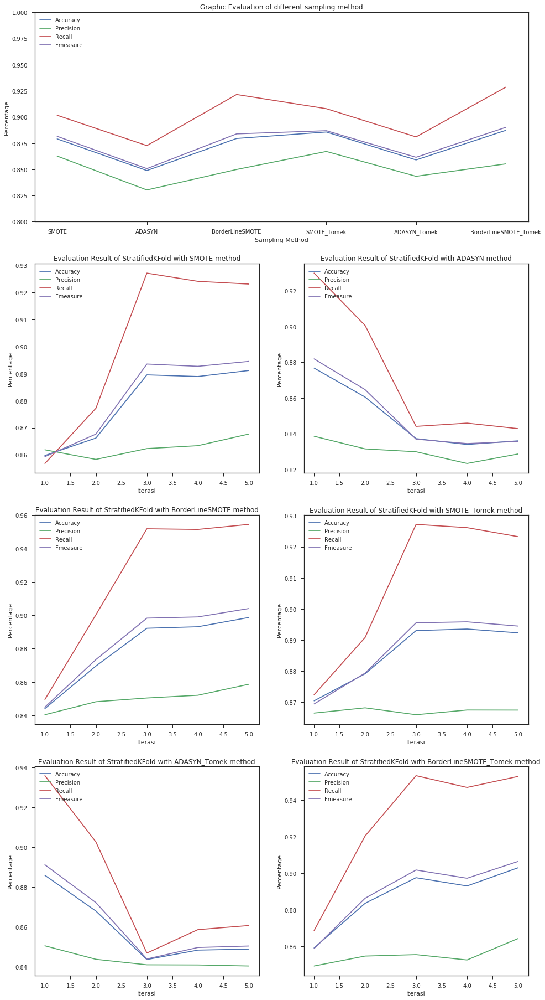

# Tugas 2 Data Mining (IF184951)

## Outline
- [Tugas 2 Data Mining (IF184951)](#tugas-2-data-mining-if184951)
  - [Outline](#outline)
  - [Dataset `Adult` :](#dataset-adult)
  - [Tugas](#tugas)
  - [Implementasi](#implementasi)
  - [Laporan](#laporan)
  - [Requirement](#requirement)
  - [Dokumentasi](#dokumentasi)

## Dataset `Adult` :
| Data | Value |
|------|:-----:|
| Data Set Characteristics: | Multivariate |
| Attribute Characteristics: | Categorical, Integer |
| Associated Tasks: | Classification |
| Number of Instances: | 48842 |
| Number of Attributes: | 14 |
| Missing Values? | Yes |
| Area: | Social |
| Date Donated : | 1996-05-01 |

## Tugas
Dataset	yang	dianalisis	adalah	dataset	Adult	dari	UCI	Machine	Learning	Repository.	Tugas	yang	harus	dilakukan	adalah:	
1. Melakukan	reduksi	dimensi	dan	seleksi	fitur	
2. Melakukan	sampling	data	
3. Menangani	permasalahan	imbalanced	dataset		

## Implementasi
Implementasi dapat diakses pada [LINK](tugas-2.ipynb)

## Laporan
- Laporan dalam bentuk Latex dapat diakses pada [LINK](tugas-2.tex)
- Laporan dalam bentuk PDF dapat diakses pada [LINK](tugas_2.pdf)

## Requirement
- Tugas 1
- Tool
    - Anaconda
    - Jupyter Notebook / Jupyter Lab
- Library
    - `sklearn`
    - `imblearn` (install)

## Dokumentasi 
- Data dari tugas 1 di reduksi dahulu menggunakan `StandardScaler` kemudian `PCA`.
- Setelah direduksi, terdapat *imbalenced dataset* menggunakan teknik sampling.
- Pada tugas ini kita membandingkan beberapa teknik sampling yaitu :
    - `SMOTE`,
    - `ADASYN`, 
    - `BorderLineSMOTE`, 
    - `SMOTE + TomekLink`, 
    - `ADASYN + TomekLinks`,
    - `BorderLineSMOTE + TomekLinks`
- Setelah melakukan sampling, langkah selanjutnya adalah menggunakan teknik sampling untuk *data reduction* kemudian mengklasifikasikannya menggunakan `RandomForestClassifier` dengan 20 pohon.
- Didapatkan hasil sebagai berikut :

